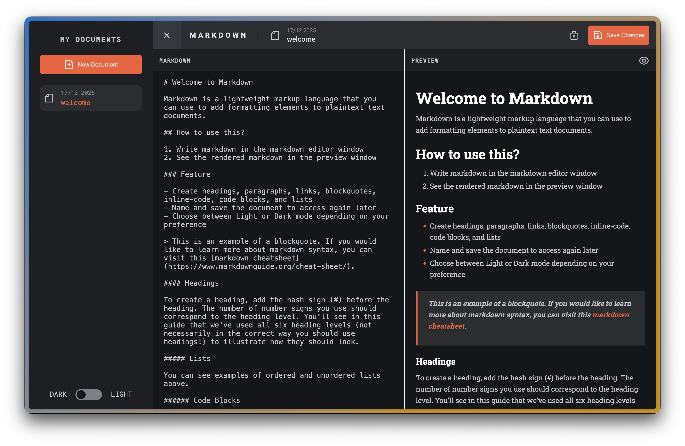

# Markdown editor

A simple markdown editor built with [React js](https://react.dev/).

## [Live Preview](https://mde-fm-alvs.netlify.app/)

The designs are from a [frontendmentor challenge](https://www.frontendmentor.io/challenges/tic-tac-toe-game-Re7ZF_E2v)

> Frontendmentor is a platform offering, some free and paywalled professional designs for frontend developers to create stunning projects.

View my list of all solved Frontementor challenges [here](https://github.com/Av1-Lv5/Frontendmentor-challenges)

## Technical details

- Used Vite build tool
- React's Context api is used for managing the states
- Made use of [nanoid](https://github.com/ai/nanoid)
- The input is parsed using [markdown-it](https://github.com/markdown-it/markdown-it)
- [svgr](https://www.npmjs.com/package/vite-plugin-svgr) converts svg files as react components.

## Useful resources

- [React docs](https://react.dev/)
- [pnpm docs](https://pnpm.io/installation)
- Interactive [React js course](https://scrimba.com/learn/learnreact/) by Bob Ziroll on Scrimba
